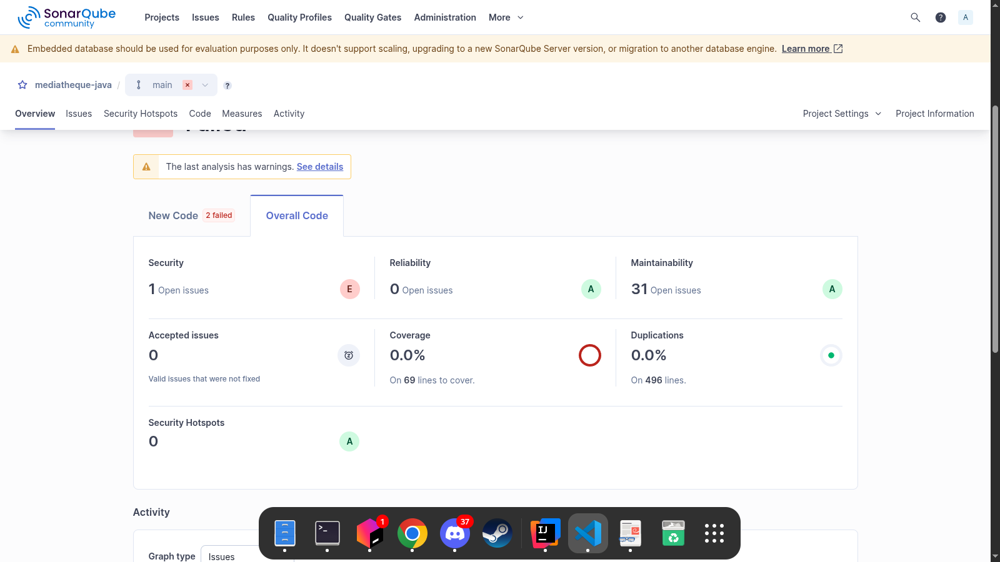
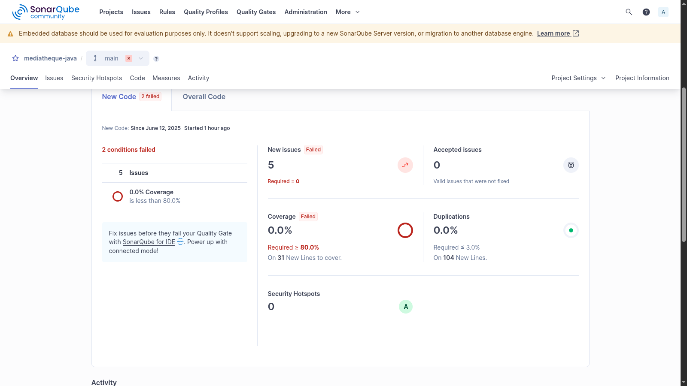
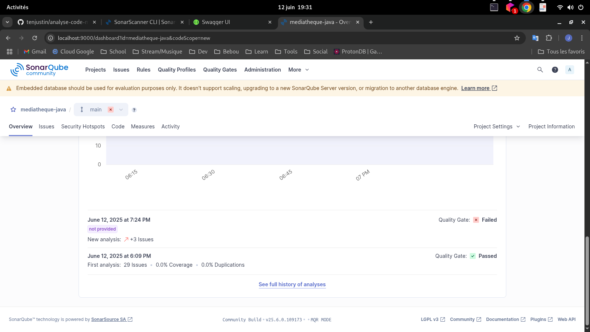
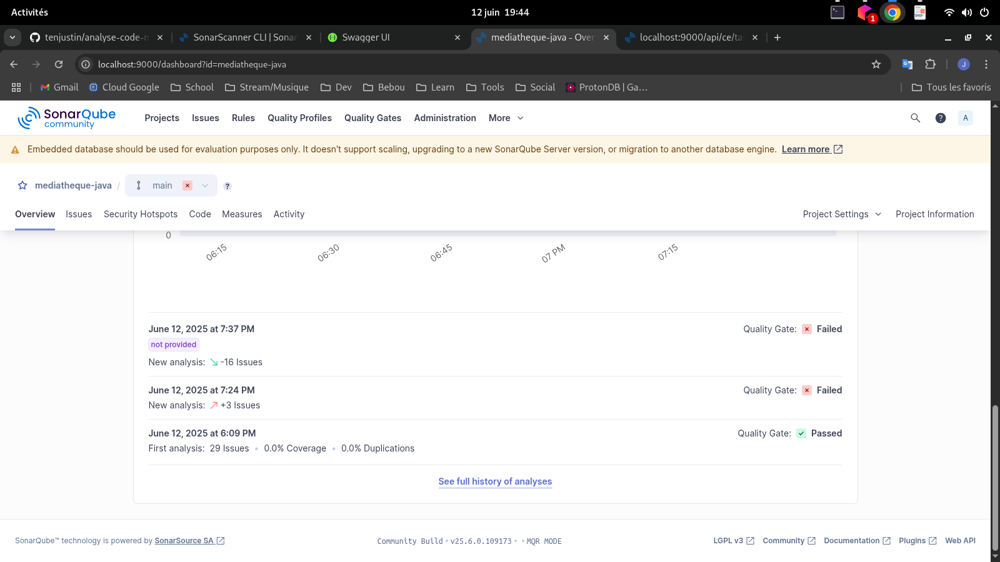

Pour le projet il vous faut démarrer une base de données postgres  
Si vous avez Docker sur votre poste lancez cette commande :  
```docker run --name pg1 -p 5432:5432 -e POSTGRES_USER=mkyong -e POSTGRES_PASSWORD=password -e POSTGRES_DB=mydb -d postgres:15-alpine```
Ensuite lancez le projet depuis l'IDE de votre choix et aller set dans le application.properties le mdp de la Bdd (cf. commande au dessus)

### Composition du groupe  

- TENE Justin
- BROCCOLI Mathieu
- HAJEM Jihan
- SCHOUKROUN Alexandre

# Présentation du projet  

Pour ce projet ne nécessitant que peut de règle métier, nous avons décidé de produire un code simple, avec nos controller qui gère la validation et la gestion des ressources, ceci connecté à une base de données via des repository (Utilisation d'un ORM).  
Cela nous a permis de minimiser le code avec des classes simples et à responsabilité unique.
Pour la suite du projet nous pourrions mettre en place des tests unitaires et des tests d'intégration afin de rendre notre code plus robuste. Cela pourrait être automatisé dans une CI avec les analyses sonarqube.

# Première Analyse  

Nous pouvons voir que malgré la 30aines d'Issue liée à la maintenance nous avons réussi à faire du code relativement qualitatif  

  

# Deuxième analyse 

Sur la deuxème partie de l'implémentation des fonctionnalités, nous avons réussi à garder le projet dans un état stable, ce qui nous a permis d'attaquer la correction des Issue.  

  

# Historique des analyse  

Lors de la troisième analyse nous avons pu corriger une grande partie des Issue, celles restantes étant plus couteuses que celle que nous avons réussi à corriger.

  

  